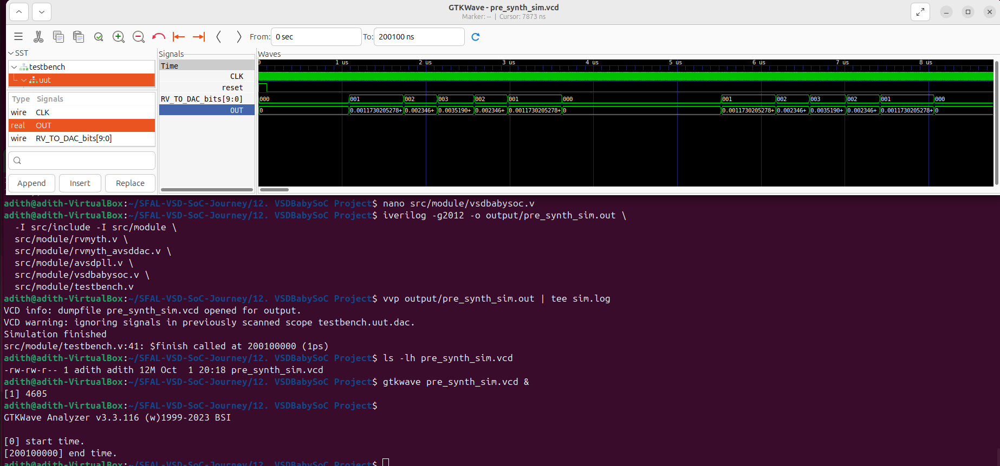
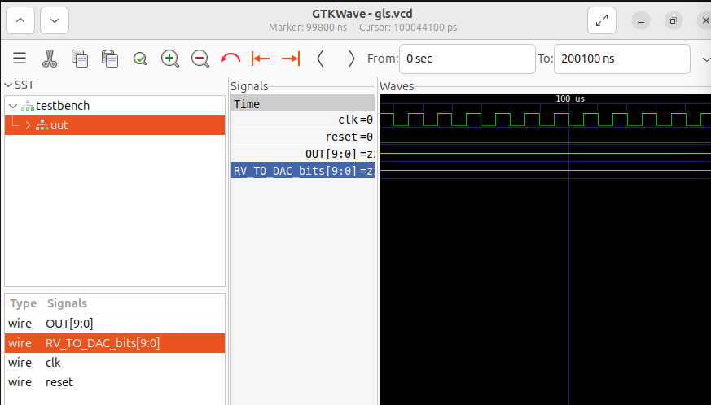

# Week 3 – Part 1 : Post-Synthesis GLS  

### Objective  
To perform gate-level simulation (GLS) after synthesis of the BabySoC design and confirm that the post-synthesis behavior matches the RTL functional simulation from Week 2.

---

### Steps  

**1. Synthesis**  
- Performed synthesis of `vsdbabysoc.v` using **Yosys**.  
- Generated the gate-level netlist `vsdbabysoc_synth.v` and synthesis log file.  

**2. Gate-Level Simulation (GLS)**  
- Used **Icarus Verilog** to simulate the synthesized netlist with the same testbench used for the functional simulation.  
  ```bash
  iverilog -o gls_sim.vvp vsdbabysoc_synth.v ../tb/tb_vsdbabysoc_gls.v
  vvp gls_sim.vvp
Generated the waveform file gls.vcd and viewed it in GTKWave.

### Waveform Comparison

**Functional Simulation Output**


**Post-Synthesis GLS Output**


**Waveform Comparison**
-Signals compared: clk, reset, OUT[9:0], RV_TO_DAC_bits[9:0]
-Clock behavior: identical toggling in both simulations
-Reset behavior: asserted and deasserted at the same time in both
-Output behavior: OUT and RV_TO_DAC_bits remain stable after reset in both runs
-No undefined values: no X or mismatch observed after reset
-Observation: GLS outputs show high-impedance (Z) as expected for top-level undriven ports — matches functional behavior

Result
GLS output = Functional output
The gate-level simulation results match the functional simulation, confirming that synthesis preserved the design’s behavior.
