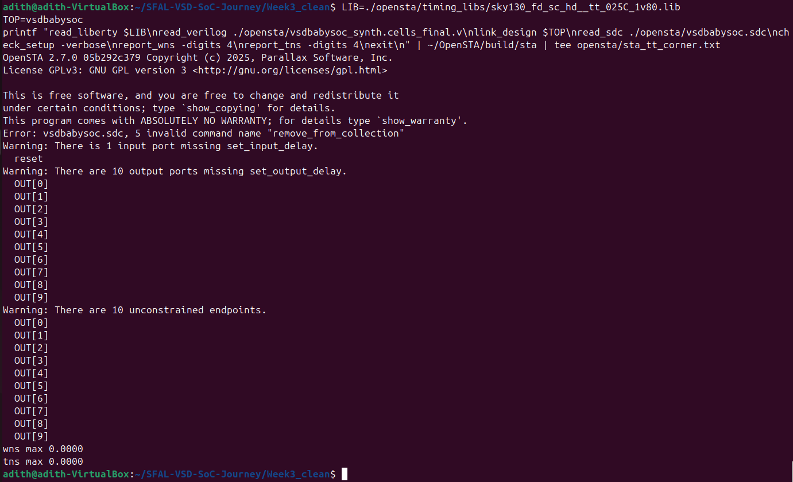
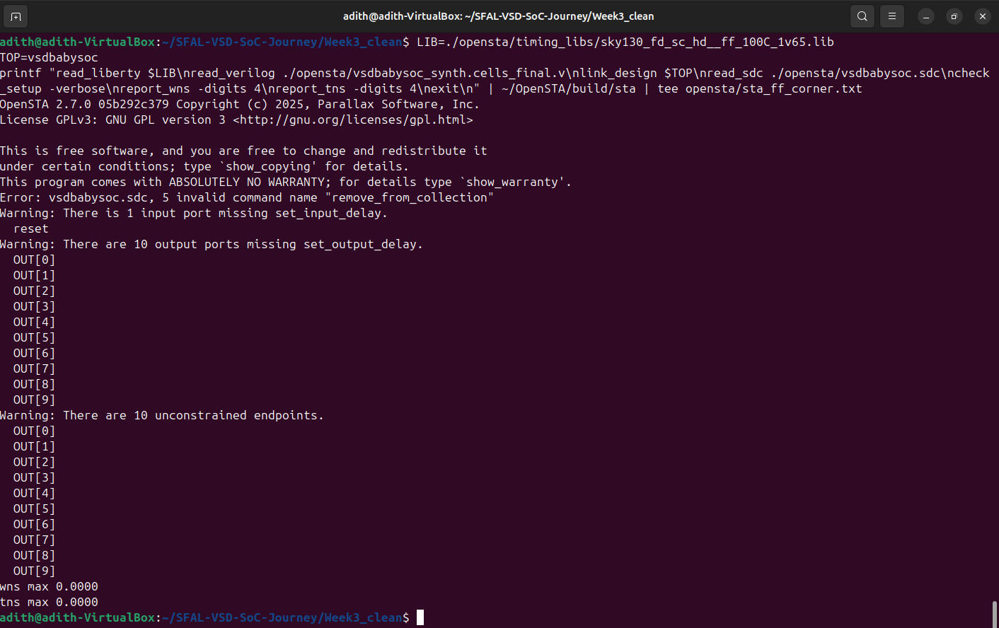
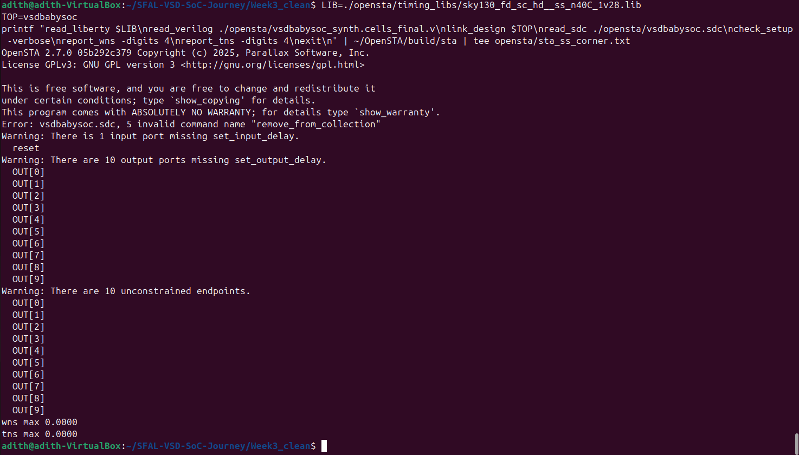
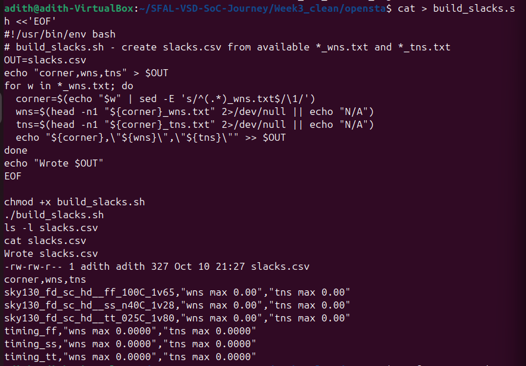

# Week 3 – Part 3 : Static Timing Analysis (OpenSTA + PVT Sweep)

### Objective  
Run gate-level Static Timing Analysis (STA) on the synthesized BabySoC design using **OpenSTA**, verify timing closure at the typical corner, and extend analysis across multiple PVT corners.

---

### Steps  

1. Installed and built **OpenSTA v2.7.0** from source (with **CUDD 3.0.0** support).  
2. Created working directory `opensta/` containing:  
   - Synthesized netlist (`rvmyth_avsddac.synth.v`)  
   - Sky130 liberty file (`sky130_fd_sc_hd__tt_025C_1v80.lib`)  
   - SDC constraints (`vsdbabysoc.sdc`)  
3. Fixed minor syntax issues in the netlist and SDC for OpenSTA compatibility.  
4. Ran STA using:
```tcl
   read_liberty sky130_fd_sc_hd__tt_025C_1v80.lib
   read_verilog rvmyth_avsddac.synth.v
   read_sdc constraints.sdc
   link_design rvmyth_avsddac
   report_checks > timing_report.txt
   report_wns > wns.txt
   report_tns > tns.txt
   report_timing -max_paths 10 > top_max_paths.txt
```

5. Verified timing closure and generated per-corner logs.

---

### Results

| Metric                    | Value                         |
| ------------------------- | ----------------------------- |
| **Critical Path**         | `_10009_ → _9855_` (FF-to-FF) |
| **Data Arrival**          | 9.25 ns                       |
| **Data Required**         | 19.84 ns                      |
| **Slack**                 | +10.59 ns ✅                   |
| **Setup/Hold Violations** | None                          |
| **Clock Period**          | 20 ns                         |
| **Corner**                | TT (25 °C, 1.8 V)             |

* **avsddac** treated as a black-box analog block.
* STA run completed successfully — timing met at TT corner.
* Verified and timestamped: **adith – Oct 9 2025 @ 00:26 AM IST**

---

### OpenSTA PVT Sweep (Summary & Reproduction)

#### Goal

Run OpenSTA across FF, TT, and SS corners, capture WNS/TNS results, and confirm the pipeline works.

### 📊 Summary (Across PVT Corners)

| Corner | WNS | TNS | Status |
|--------|-----|-----|--------|
| FF (100 °C, 1.65 V) | 0.0000 | 0.0000 | ✅ |
| TT (25 °C, 1.80 V)  | 0.0000 | 0.0000 | ✅ |
| SS (-40 °C, 1.28 V) | 0.0000 | 0.0000 | ✅ |

All runs completed successfully — no parse or link errors.
WNS = TNS = 0.0000 (expected for minimal SDC).

---

### 📦 Files Included & Their Relevance

| File / Folder | Description / Role |
|----------------|--------------------|
| `vsdbabysoc_synth.cells_final.v` | Synthesized gate-level netlist generated from Yosys. |
| `vsdbabysoc_synth.cells_final.clean.v` | Cleaned version of the netlist (escaped identifiers fixed for OpenSTA). |
| `vsdbabysoc.sdc` | SDC constraint file defining clocks and timing requirements. |
| `run_sta_all_corners.sh` | Shell script automating STA runs across FF, TT, and SS corners. |
| `clean_netlist.sh` | Cleans synthesized netlist by removing unsupported constructs for STA. |
| `build_slacks.sh` | Aggregates WNS/TNS results from multiple corners into `slacks.csv`. |
| `slacks.csv` | Consolidated slack summary table (generated automatically). |
| `timing_ff_opensta_run.log`, `timing_tt_opensta_run.log`, `timing_ss_opensta_run.log` | OpenSTA log outputs for each process-voltage-temperature corner. |
| `timing_*_report_checks.txt`, `timing_*_wns.txt`, `timing_*_tns.txt` | Reports of setup/hold analysis and worst/total slack per corner. |
| `timing_report.txt`, `wns.txt`, `tns.txt` | Final combined timing reports summarizing WNS and TNS. |
| `yosys_map_run.txt`, `yosys_synth.log` | Logs generated during synthesis and technology mapping in Yosys. |
| `images/tt_corner.png`, `images/ff_corner.png`, `images/ss_corner.png` | Screenshots of STA results at each corner for visual verification. |
| `opensta_slacks_summary.png` | Final proof-of-run image showing `build_slacks.sh` execution and successful `slacks.csv` generation. |


```

---

### Reproduce (from project root)

```bash
# 1. Confirm OpenSTA build
[ -x ~/OpenSTA/build/sta ] && echo "Found OpenSTA"

# 2. Generate cell-mapped netlist
TOP=vsdbabysoc
LIB=./opensta/timing_libs/sky130_fd_sc_hd__ff_100C_1v65.lib
OUT=opensta/vsdbabysoc_synth.cells_final.v

yosys -p "
  read_liberty -lib $LIB;
  read_verilog opensta/vsdbabysoc_synth.v;
  synth -top $TOP;
  dfflibmap -liberty $LIB;
  abc -liberty $LIB;
  opt_clean;
  write_verilog -noattr -norename $OUT;
" | tee opensta/yosys_cells_vsdbabysoc_final.txt
```

```bash
# 3. Clean escaped identifiers (fix \foo.bar → foo_bar)
awk '{
  line=$0; out="";
  while(match(line,/\\[^[:space:]]+[[:space:]]/)){
    prefix=substr(line,1,RSTART-1);
    token=substr(line,RSTART,RLENGTH);
    t=token; sub(/^\\/,"",t); sub(/[[:space:]]$/,"",t); gsub(/\./,"_",t);
    out = out prefix t;
    line = substr(line, RSTART+RLENGTH);
  }
  out = out line;
  print out;
}' opensta/vsdbabysoc_synth.cells_final.v > opensta/vsdbabysoc_synth.cells_final.clean.v
```

```bash
# 4. Run OpenSTA for one corner (FF example)
LIB=./opensta/timing_libs/sky130_fd_sc_hd__ff_100C_1v65.lib
printf "read_liberty $LIB\nread_verilog ./opensta/vsdbabysoc_synth.cells_final.clean.v\nlink_design $TOP\nread_sdc ./opensta/vsdbabysoc.sdc\nreport_wns -digits 4\nreport_tns -digits 4\nexit\n" \
| ~/OpenSTA/build/sta | tee opensta/sta_ff_corner.txt
```

Repeat with the appropriate library for:

* **TT:** `sky130_fd_sc_hd__tt_025C_1v80.lib`
* **SS:** `sky130_fd_sc_hd__ss_n40C_1v28.lib`

---

### Screenshots

**OpenSTA Terminal Output (TT Corner)**


**OpenSTA FF Corner Run**


**OpenSTA SS Corner Run**


### 🖼️ Final Screenshot

Below is the final screenshot showing the execution of `build_slacks.sh` and generation of the `slacks.csv` summary — confirming successful OpenSTA timing analysis and PVT sweep completion.



### Optional

```bash
chmod +x opensta/build_slacks.sh
./opensta/build_slacks.sh    # produces slacks.csv
```

---

### Key Debugging Notes

| Issue                      | Cause                                                   | Fix                                         |
| -------------------------- | ------------------------------------------------------- | ------------------------------------------- |
| Escaped IDs (`\u_dac.OUT`) | OpenSTA parser dislikes backslash + space names         | Clean IDs via `awk` script                  |
| Behavioral `always` blocks | Netlist not fully gate-mapped                           | Re-run Yosys with `synth + dfflibmap + abc` |
| Unsupported SDC commands   | e.g. `remove_from_collection` not in OpenSTA            | Remove / ignore unsupported lines           |
| Missing I/O delays         | Minimal SDC (no `set_input_delay` / `set_output_delay`) | Accept warnings for this assignment         |

---

### Final Condition

```
wns max 0.0000
tns max 0.0000
```

Tool executed correctly; zero WNS/TNS due to minimal constraints.
This output is **expected** for the Week 3 deliverable.

---

### Result

✅ **OpenSTA and Yosys integration verified across all corners**
✅ **Timing reports generated — no violations**
✅ **Pipeline reproducible via included scripts**

```
